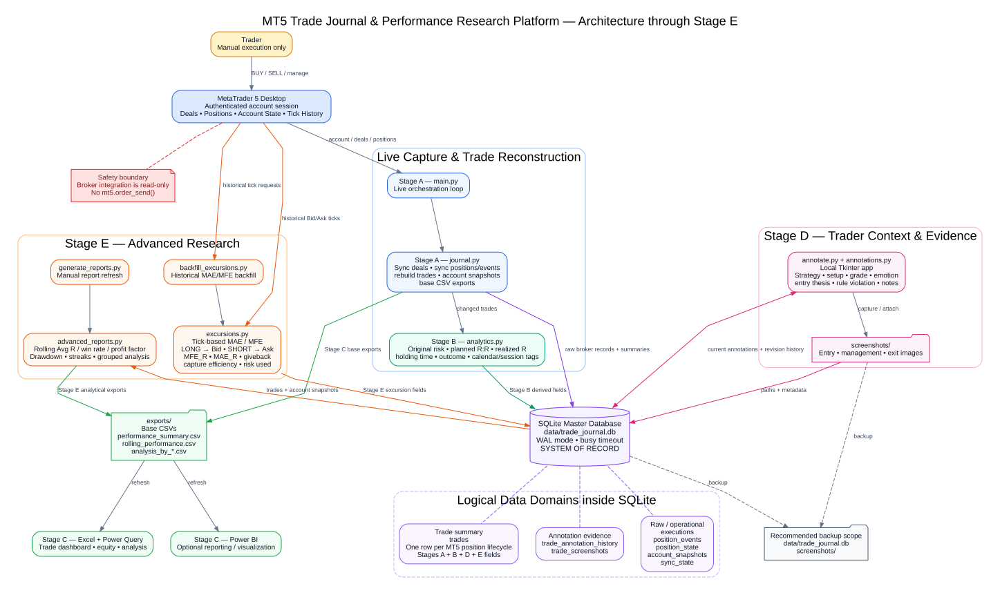

# MT5 Trade Journal & Performance Research Platform

> **Current implementation**  
> A read-only MetaTrader 5 trade-journaling, annotation, analytics, and research platform built with Python, SQLite, Excel, and MT5 historical tick data.

## 1. Overview

This project converts actual MetaTrader 5 trading activity into a durable research database and reporting workflow. The broker account remains the source of executed trading activity, SQLite is the system of record, and Excel is the reporting layer rather than the v primary data store.

The platform currently covers **Stages A–E**:

- **Stage A — Broker capture and trade reconstruction:** records broker deals, position-state changes, account snapshots, and one-row-per-position trade summaries.
- **Stage B — Derived trade metrics:** calculates original monetary risk, planned reward/risk, realized R-multiple, holding period, calendar fields, session classification, and outcome.
- **Stage C — Reporting layer:** exposes refreshable CSV data for Excel Power Query / Power BI dashboards and performance analysis.
- **Stage D — Trade context and evidence:** adds a local annotation application, structured strategy/setup/grade/emotion/rule-violation fields, annotation history, and screenshot management.
- **Stage E — Advanced performance research:** reconstructs MAE/MFE from MT5 tick history and generates rolling, drawdown, streak, strategy, setup, instrument, session, behaviour, and other analytical reports.

The architecture intentionally separates **raw broker evidence**, **derived analytics**, **trader annotations**, and **reporting outputs** so that each can be audited or rebuilt independently.

---

## 2. Core design principles

### Broker activity is the source of truth

Trades are not created manually in Excel. The logger reads actual MT5 activity and stores executed deals and position state locally.

### SQLite is the master database

`data/trade_journal.db` is the authoritative local record. CSV and Excel files are replaceable reporting outputs.

### Raw data is preserved

Executions are retained independently from the summarized `trades` table. Partial closes, fees, commissions, swaps, and position events therefore remain available for later reconstruction and audit.

### Analytics are rebuildable

Risk, R-multiple, session tags, MAE/MFE, rolling statistics, and summary reports are derived fields. They can be recalculated without changing the underlying broker records.

### Subjective context is explicitly separated

Strategy, setup, grade, emotion, thesis, notes, rule violations, and screenshots are trader-supplied annotations. An annotation-history table preserves previous saves instead of silently overwriting the research trail.

### Broker integration is read-only

The project reads MT5 account, position, deal, and tick data. It does **not** contain trade-execution logic such as `mt5.order_send()`.

---

## 3. System architecture

At a high level:



<!-- ```text
Trader
  │ manually executes trades
  ▼
MetaTrader 5 Terminal
  │
  ├── deals / positions / account state
  │             │
  │             ▼
  │        Python Logger
  │             │
  │             ▼
  │      SQLite Master Database ◄──── Annotation App
  │             │                         │
  │             │                         └── screenshots / notes / tags
  │             │
  │             ├── Stage B analytics
  │             ├── Stage E MAE/MFE + advanced reports
  │             │
  │             ▼
  │          CSV exports
  │             │
  │             ├── Excel / Power Query
  │             └── Power BI
  │
  └── historical Bid/Ask ticks ──► Stage E excursion engine
``` -->

---

## 4. Technology stack

| Component | Purpose |
|---|---|
| **MetaTrader 5 Desktop** | Broker/account source for positions, deals, account information, and historical tick data |
| **Python** | Collection, transformation, analytics, annotation application, reporting |
| **MetaTrader5 Python package** | Read-only interface to the running MT5 terminal |
| **SQLite** | Durable local system of record |
| **pandas** | Advanced analysis and report generation |
| **Tkinter** | Local Stage D annotation application |
| **Pillow** | Screenshot capture/management |
| **CSV** | Stable interchange layer for Excel/Power BI |
| **Excel Power Query** | Reporting and dashboard layer |

Current Python dependencies are declared in `requirements.txt`:

```text
MetaTrader5
pandas
openpyxl
Pillow
```

---


## 5. Data model

### 5.1 `executions`

Stores raw MT5 deals/executions. The composite key `(account_login, deal_ticket)` prevents duplicate ingestion when the logger deliberately rereads overlapping history windows.

Typical fields include:

```text
account_login
broker deal ticket
order ticket
position_id
time / time_msc
deal type / entry type
symbol
volume
price
profit
commission
swap
fee
SL / TP
magic / reason / comment
```

### 5.2 `position_events`

Stores observed lifecycle changes such as:

```text
OPEN
CLOSED
VOLUME_CHANGE
SL_CHANGE
TP_CHANGE
ENTRY_PRICE_CHANGE
```

This gives a useful audit trail beyond the final completed trade record.

### 5.3 `position_state`

Stores the latest observed state of each open MT5 position and supports change detection between polling cycles.

### 5.4 `trades`

The central one-row-per-position analytical table. It combines:

**Stage A broker summary**

```text
symbol
direction
entry/exit time
entry/exit price
volume
initial SL / TP
profit / commission / swap / fee
net P&L
status
```

**Stage B analytics**

```text
risk_amount
planned_reward_amount
planned_rr
r_multiple
holding_minutes
entry date / weekday / month / year / hour
entry_session
outcome
risk calculation status/context
```

**Stage D annotations**

```text
strategy
setup
grade
rule_violation
rule_violation_type
entry_thesis
emotion
notes
primary_screenshot_path
```

**Stage E analytics**

```text
mfe_price / mae_price
mfe_r / mae_r
mfe_amount_est / mae_amount_est
capture_efficiency_pct
giveback_r
risk_used_pct
planned_tp_touched
initial_sl_touched
MFE/MAE timestamps
tick count
excursion status/context
```

### 5.5 `account_snapshots`

Periodically stores account-level values:

```text
balance
equity
margin
free margin
floating profit
```

These snapshots support sampled account-equity and drawdown analysis.

### 5.6 `trade_annotation_history`

Stores a revision every time the annotation app saves a trade. This preserves entry-time thinking and subsequent post-trade review instead of replacing earlier context.

### 5.7 `trade_screenshots`

Stores screenshot metadata, captions, source, primary-image status, and file paths. Image files themselves live under `screenshots/`.

### 5.8 `sync_state`

Stores internal checkpoints and feature activation markers used by the logger, including Stage E activation state.

---

## 6. Stage-by-stage implementation

### Stage A — Reliable broker capture

Stage A establishes the durable ingestion foundation:

```text
MT5 → Python → SQLite
```

Primary functions:

- Connect to the running MT5 terminal.
- Import historical and recent deals.
- Reread an overlap period to reduce the chance of missed executions.
- Rely on database keys to reject duplicate deals safely.
- Poll open positions and detect position-state changes.
- Reconstruct one summarized trade row from underlying executions.
- Capture periodic account snapshots.
- Export database views to CSV for external reporting.

### Stage B — Trade analytics

Stage B derives analytical fields from the raw history:

- Original monetary risk.
- Planned monetary reward.
- Planned reward:risk.
- Realized R-multiple.
- Holding duration.
- Outcome classification.
- Local date/time dimensions.
- Session classification.

Original risk is intentionally preserved rather than being overwritten when a stop is later moved to breakeven or profit.

### Stage C — Reporting architecture

Stage C treats Excel and Power BI as consumers, not masters.

Recommended flow:

```text
SQLite
  ↓
CSV exports
  ↓
Power Query / Power BI
  ↓
Dashboard
```

Common dashboard measures include:

- Trade count.
- Win rate.
- Net P&L.
- Average R.
- Expectancy.
- Profit factor.
- Average winner / loser.
- Holding period.
- Equity curve.
- Drawdown.
- Performance by month, weekday, session, direction, and instrument.

### Stage D — Annotation and screenshots

Stage D adds a desktop UI for trader-owned information:

- Strategy.
- Setup.
- Grade.
- Emotion.
- Entry thesis.
- Rule violation and violation type.
- Post-trade notes.
- Screenshot capture or attachment.

Every save updates the current trade record and creates an annotation-history revision.

### Stage E — Advanced research analytics

Stage E adds tick-level excursion analysis and pre-aggregated research reports.

For **LONG** positions, Bid ticks are used as the liquidation-side executable price. For **SHORT** positions, Ask ticks are used.

Stage E calculates:

- **MFE (Maximum Favorable Excursion)** — best favorable movement reached while the trade was open.
- **MAE (Maximum Adverse Excursion)** — worst adverse movement reached while the trade was open.
- **MFE_R / MAE_R** — price excursions normalized to the original 1R stop distance.
- **Capture efficiency** — realized R divided by MFE_R.
- **Giveback R** — favorable excursion not retained by the final exit.
- **Risk used %** — how much of the original 1R stop distance price travelled against the trade.
- Whether the original TP or SL level was touched.
- Tick count and excursion calculation metadata.

It also produces rolling and segmented research outputs.

---

## 7. Runtime workflow

### 7.1 Start MetaTrader 5

Open MT5 and log into the account being journaled.

### 7.2 Activate the Python environment

```powershell
.\.venv\Scripts\Activate.ps1
```

### 7.3 Start the logger

```powershell
python main.py
```

or use:

```text
run_logger.bat
```

The logger continuously:

1. Synchronizes recent broker deals.
2. Polls current positions and records state changes.
3. Rebuilds affected trade summaries.
4. Calculates Stage B analytics.
5. Calculates Stage E MAE/MFE for newly closed Stage E trades.
6. Captures account snapshots.
7. Regenerates base CSV exports.
8. Regenerates advanced reports periodically.

### 7.4 Start the annotation application

In a second process:

```powershell
python annotate.py
```

or:

```text
run_annotation_app.bat
```

Use this application to add trader-owned context without editing imported Excel data.

### 7.5 Refresh Excel 

Excel Power Query can read the generated CSV files. SQLite remains the master record.

---

## 8. Configuration

Primary settings live in `config.py`.

### Collection settings

```python
POLL_SECONDS = 2
BACKFILL_DAYS = 30
OVERLAP_SECONDS = 120
ACCOUNT_SNAPSHOT_SECONDS = 60
EXPORT_SECONDS = 10
```

### Time and session analytics

```python
ANALYTICS_TIMEZONE = "Africa/Nairobi"
SESSION_TIMEZONE = "UTC"
```

Default analytical session buckets:

```text
ASIA                 00:00–07:00 UTC
LONDON               07:00–12:00 UTC
LONDON_NY_OVERLAP    12:00–16:00 UTC
NEW_YORK             16:00–21:00 UTC
OFF_HOURS            21:00–24:00 UTC
```

These are fixed analytical buckets rather than DST-aware exchange calendars.

### Stage E settings

```python
EXCURSION_TICK_CHUNK_HOURS = 6
AUTO_EXCURSION_BATCH = 2
ADVANCED_REPORT_SECONDS = 60
ROLLING_WINDOW_TRADES = 20
MIN_SAMPLE_TRADES = 20
```

`MIN_SAMPLE_TRADES` is a descriptive reporting threshold only; it does not determine whether a strategy has a statistically proven edge.

---

## 9. Database reliability

The SQLite connection enables:

```text
WAL journal mode
foreign keys
10-second busy timeout
```

WAL mode is useful because the logger, annotation app, and readers may be active at the same time. SQLite still serializes writes, so the busy timeout reduces unnecessary failures when short write collisions occur.

### Backup priority

The most important file to protect is:

```text
data/trade_journal.db
```

The `screenshots/` directory should also be backed up because the database stores paths/metadata rather than image binary content.

The `exports/` directory is rebuildable and should not be treated as the system of record.

---

## 10. Recommended daily workflow

### When entering a trade

```text
1. Execute manually in MT5.
2. Logger captures the broker execution.
3. Open/refresh the annotation app.
4. Select the OPEN trade.
5. Record strategy, setup, grade, emotion and entry thesis.
6. Attach/capture an entry screenshot.
7. Save the annotation.
```

### While managing the trade

The logger continues recording position-state changes and broker executions. Optional additional screenshots can be attached during management.

### After closing the trade

```text
1. Logger captures closing deal(s).
2. Trade summary and realized R are rebuilt.
3. Stage E reconstructs MAE/MFE when tick history is available.
4. Add post-trade notes and any rule-violation information.
5. Attach an exit/review screenshot if useful.
6. Review updated dashboards after export/refresh.
```

---

## 11. Key analytical definitions

### R-multiple

```text
Realized R = Net realized P&L / Original monetary risk
```

### MFE_R

Maximum favorable price excursion divided by the original stop distance.

### MAE_R

Maximum adverse price excursion divided by the original stop distance. This is normally zero or negative.

### Capture efficiency

```text
Capture Efficiency % = Realized R / MFE_R × 100
```

A trade can have negative capture efficiency if it moved favorably but ultimately closed at a loss.

### Giveback R

```text
Giveback R = max(0, MFE_R − Realized R)
```

### Risk used %

```text
Risk Used % = max(0, −MAE_R × 100)
```

A value above 100% indicates that observed price travelled beyond the original 1R stop distance at some point in the available tick record.

---

## 12. Known limitations

### Hedging vs. netting accounts

The current summarized trade model assumes one MT5 position lifecycle maps naturally to one journal trade. This works best with **hedging accounts**.

On netting/reversal accounts, one MT5 position lifecycle may combine multiple trading ideas. Custom trade-idea splitting would be required for perfect semantic reconstruction.

### Historical monetary risk reconstruction

For historical trades, monetary risk reconstructed with MT5 `order_calc_profit()` uses the current trading environment. Price-normalized R-based measures are therefore preferred for long-term historical comparison.

### Tick-history coverage

MAE/MFE quality depends on the broker/server retaining the relevant MT5 Bid/Ask tick history.

### SL/TP event visibility

Position-change events can only be observed while the logger is running. If SL/TP is modified while the collector is offline, every intermediate modification may not be reconstructable later.

### Account-equity drawdown

Account equity is sampled periodically rather than on every market tick. Therefore `max_sampled_equity_drawdown` is an approximation of the worst intratrade account drawdown.

### Session buckets

Current session classification uses configured fixed UTC time windows, not a daylight-saving-aware London/New York market calendar.

### Advanced statistical inference

Stage E provides descriptive and rolling analysis. Confidence intervals, bootstrap inference, Monte Carlo path analysis, and formal edge validation are reserved for a future statistical-validation stage.

---

## 13. Validation and troubleshooting utilities

### Validate Stage B metrics

```powershell
python stage_b_check.py
```

### Validate Stage D annotation schema

```powershell
python stage_d_check.py
```

### Validate Stage E schema and coverage

```powershell
python stage_e_check.py
```

### Inspect the SQLite database

```powershell
python inspect_db.py
```

### Regenerate advanced reports immediately

```powershell
python generate_reports.py
```

### Common checks

If new broker activity is not appearing:

1. Confirm MT5 desktop is open and logged into the intended account.
2. Confirm the Python virtual environment is active.
3. Run `python main.py` and inspect MT5 initialization/account errors.
4. Verify the account number and server printed by the logger.
5. Check that `data/trade_journal.db` is writable.

If Excel is stale but SQLite is correct:

1. Check that `exports/trades.csv` has updated.
2. Refresh Power Query / Power BI.
3. Check whether the query uses a fixed `Choose Columns` or `Removed Other Columns` step that excludes newly appended Stage D/E fields.

If MAE/MFE is missing:

1. Confirm the trade is closed.
2. Check `excursion_status`.
3. Run a small `backfill_excursions.py` test.
4. Verify the broker/terminal has tick history covering the full trade interval.

---

## 14. Security and operational notes

- Do not hard-code broker passwords into project source files.
- Prefer allowing the already authenticated MT5 desktop terminal to provide the account session.
- Keep the live SQLite database on a local disk rather than a network share.
- Back up `data/trade_journal.db` and `screenshots/` regularly.
- Avoid running two logger processes simultaneously against the same account/database.
- Excel/Power BI should be treated as read/report consumers; do not use them as the primary write-back mechanism for annotations.

---

## 15. Current maturity and future roadmap

Stage E represents a complete usable trade-journal and descriptive performance-research foundation.

Potential future stages include:

- **Stage F — Statistical validation:** confidence intervals, bootstrap analysis, Monte Carlo trade-path simulation, uncertainty around expectancy, and sample-size analysis.
- **Stage G — Edge discovery:** multidimensional combinations such as strategy × setup × symbol × session × direction × grade.
- **Stage H — Risk modelling:** position-sizing simulations, drawdown constraints, risk-of-ruin analysis, and risk-budget rules.
- **Stage I — Monitoring and alerts:** rolling deterioration, drawdown, streak, and regime-change warnings.
- **Stage J — Production hardening:** automatic Windows startup, scheduled backups, integrity checks, archival, and recovery procedures.
- **Stage K — Separate strategy backtester:** systematic historical signal simulation for comparison with actual live execution behaviour.

These later stages are intentionally separate from the Stage A–E capture foundation so that the current journal remains stable and usable while sufficient live data accumulates.

---

## 16. Operating summary

For normal day-to-day use:

```powershell
# Terminal 1 — logger
.\.venv\Scripts\Activate.ps1
python main.py

# Terminal 2 — annotation app
.\.venv\Scripts\Activate.ps1
python annotate.py
```

Then trade manually in MT5, annotate relevant trades, and refresh Excel/Power BI when needed.

**Master record:** `data/trade_journal.db`  
**Visual evidence:** `screenshots/`  
**Reporting outputs:** `exports/`  
**Broker execution:** manual in MetaTrader 5

---

## 17. Disclaimer

This software is a personal trading-journal and research system. It does not provide investment advice, guarantee profitability, or automatically execute trades. Historical performance statistics and backfilled analytics do not guarantee future results.
